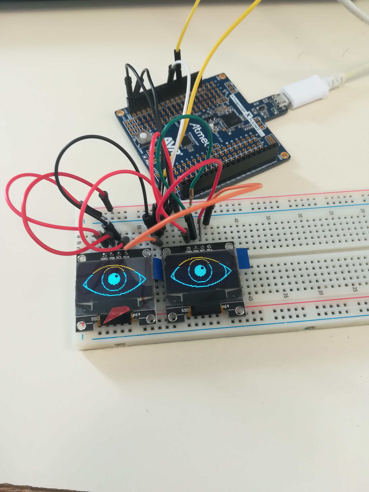

 <h1>Rapport du  10/12/18:</h1>

<h2>Plannification du projet</h2>  
Durant cette première séance, nous avons fait le cahier des charges qui comprend: 

<ul>
  <li> la description du projet 
  <li> ses différentes fonctionnalités 
  <li> quelques problèmes que nous risquons de rencontrer
  </ul>
Puis nous avons essayé de plannifier nos séances : 

<ul>
 <li>Différentes tâches à accomplir (que faire et dans quel ordre)
 <li>Repartition des tâches (combien de séances il nous faut et qui va le faire)

<h2>Module RTC</h2>
Ensuite, nous avons utiliser le module RTC(module pour donner l'heure en temps réel). D'abord, j'ai essayé d'afficher l'heure sur le moniteur. J'ai cherché comment utiliser le module RTC sur internet (branchement et code). J'ai utilisé un programme simple qui permet, grâce à une librairie, d'afficher certaines variables comme les secondes, les minutes, les heures, les jours, etc... Ce qui m'a permis d'afficher la date et l'heure sur le moniteur. 

<h1> Rapport du 17/12/12:</h1>

<h2>Programmation du réveil</h2>
Durant la dernière séance, nous avons réussi à afficher l'heure sur un écran lcd grâce au module RTC. J'ai cherché comment modifier notre programme afin qu'il puisse fonctionner comme un réveil. Pour cela, j'ai finalement juste choisi une heure aléatoire et j'ai demandé à l'arduino d'afficher un message sur le moniteur à l'heure voulu.
J'ai ensuite voulu utiliser un buzzer pour qu'à l'heure voulu, le buzzer émette un son. Cependant je n'ai pas réussi à faire fonctionner le buzzer. J'ai essayé de le faire marcher simplement : je l'ai branché sur une I/O, je l'ai reglé en OUTPUT. J'ai essayé d'utiliser la fonction tone (fonction qui génère une onde carré) de cette façon : tone(I/O, fréquence, durée). Cela n'a pas fonctionné. Je n'ai pas réussi à trouver la source du problème pendant cette séance.

<h2>Réveil bluetooth</h2>
Nous voulons que notre réveil soit programmable sur le téléphone. Kilian s'est occupé de cette partie mais arduino ne fonctionnait pas sur son ordinateur aujourd'hui, on a donc testé son programme sur le mien. Son téléphone était connecté à l'arduino par bluetooth, l'heure qu'il choisissait sur son téléphone s'affichait sur le moniteur.

<h2>Prochaine séance...</h2>
Je voulais, après avoir fait fonctionner le buzzer, utiliser un bouton poussoir afin que le buzzer émette un son à l'heure choisit, puis ne s'arrête qu'une fois que l'on appuie sur le bouton poussoir. 

<h1> Rapport du 07/01:</h1>

<h2>Buzzer et bouton poussoir</h2>
J'ai fait fonctionner le buzzer simplement avec la fonction tone(broche, fréquence, durée). Ensuite, j'ai rajouté un bouton poussoir afin que le buzzer s'arrête lorsqu'on appuie sur le bouton.  
Le code: 
 

 
Je pensais qu'avec ce code le buzzer s'arrêterait lorsque j'appuie sur le bouton puis re sonnerait ensuite. Sauf qu'il s'arrête de sonner quand j'appuie et ne sonne plus même si je relâche le bouton. C'est ce que je voulais faire sauf qu'il me semble que ça ne devrait pas fonctionner avec ce code. 
 
Le montage:
 

<h2>Ecran OLED</h2>
Nous avons choisi d'utiliser un écran oled plutôt que l'écran lcd. J'ai réussi à afficher du texte. Je voulais afficher le texte en blanc mais ça n'a pas fonctionné. Il me semble que les seules couleurs possibles pour cet écran sont le bleu, le orange et le noir.
 

 
Ensuite, avec Kilian, nous avons essayé de dessiner un oeil sur l'écran (nous voulons faire deux yeux à notre réveil). On a d'abord essayé de dessiner l'oeil nous même en dessiner une forme (rectangle arrondi) mais le résultat n'était pas satisfaisant. Nous avons finalement utilisé un code trouvé sur internet, voici le résultat obtenu: 
 

 
Nous avons essayé de faire le fond noir et l'oeil en bleu mais nous avons pas encore réussi.

 <h1>Rapport du  14/01/19:</h1>

 
 <h2>écran oled</h2>
 Durant la dernière séance, nous avions réussi à afficher un oeil mais le résultat n'était pas satisfaisant. D'abord, notre écran possède que 2 couleurs comme ceci: 
  

 
Grâce à la fonction invertDisplay(bool), on a inversé l'affichage de l'écran. On a donc obtenu un oeil bleu avec le fond noir. Cela rendait mieux mais l'oeil était trop petit. J'ai essyayé de changer les dimensions grâce au site http://javl.github.io/image2cpp/. En faisant ça, soit l'oeil ne rentre pas complètement sur l'écran, soit il a de mauvaises proportions et ne ressemble plus vraiment à un oeil. J'ai donc fait en sorte que l'oeil prenne toute la hauteur de l'écran mais c'était disgracieux. Finalement, J'ai pris une autre photo d'oeil sur internet et j'ai utilisé le même site pour convertir l'image en byte. En modifiant un peu les dimensions, j'ai obtenu  un résultat satisfaisant:
 

 

 
Nous utilisons un capteur de distance qui affiche l'heure lorsqu'on s'approche à une certaine distance. J'ai donc fait en sorte que l'heure prenne tout l'écran:
 

 
Je voudrais ensuite que les minutes s'affichent sur le deuxième écran. Cependant,  je ne sais pas s'il est possible de brancher deux écrans oled sur un arduino. Il y a deux branchement à faire pour l'écran et c'est sur des ports par défaut et je n'ai pas trouvé sur internet de moyen de choisir les ports nous même.

<h1>Rapport du  04/02:</h1>

<h2>Câblage de deux écran OLED sur un arduino</h2>  
 
L'écan OLED est connecté en utilisant les broches i2c de l'arduino (broches A4 et A5 sur l'arduino nano). Comme expliqué sur ce site, https://github.com/ThingPulse/esp8266-oled-ssd1306/issues/179, pour en utiliser deux sur le même arduino, il faut configurer l'adresse i2c de l'écran. L'adresse étant définie selon le positionnement de la résistance, nous avons déssouder la résistance pour la ressouder à un autre endroit, afin de modifier l'adresse. Un écran a donc l'adresse 0x3C, l'autre 0x3D. J'ai d'abord essayé de faire fonctionner l'écran dont l'adresse a été changer. Seul, il a fonctionné. J'ai ensuite câbler les 2. J'ai rajouté une ligne de code: display.begin(SSD1306_SWITCHCAPVCC, 0x3D);. Cette ligne initialise l'écran avec l'adresse 0x3D. J'ai obtenu le résultat suivant: 

<h1>Rapport du 11/02: </h1>

<h2>Ecrans OLED</h2>
La semaine dernière, j'ai réussi à utiliser deux écrans OLED simultanément, cependant j'arrivais seulement à afficher la même chose sur les deux écrans. Pour pouvoir utiliser les deux écrans à part, il faut initialiser l'écran avec l'adresse souhaité à chaque fois qu'on veut lui demander d'afficher quelque chose. Ainsi, j'ai pu afficher une heure lambda. Le code: https://github.com/kilian-salome/Robot-reveil/blob/master/Rapports%20seances/Images-import/ecran_oled.ino. Le programme fonctionne correctement lorsque j'appelle ma fonction afficherHeure() dans le setup. Cependant, lorsque que je l'appelle dans le loop, le texte ne s'affiche pas en continu. Dès qu'on sort du loop, l'écran devient noir. De ce fait, l'heure s'affiche en clignotant et non pas en continu.

<h1>Rapport du 25/02: </h1>

 <h2>Nouveaux écrans OLED</h2>
 Nous avons reçu les nouveaux écrans OLED qui affichent du contenu en couleur au lieu de bleu et orange, ils sont également plus grands. Ils ne fonctionnent pas de la même manière. Il y a 6 ports (et non pas 2) et ces écrans communiquent avec l'arduino grâce au module SPI (et non pas i2c).  
 Pour faire fonctionner un seul écran, le câblâge change, mais le code est presque similaire qu'avec les anciens écrans. J'utilise toujours la librairie adafruit. Il suffit juste de définir les différentes broches avant le setup. Cependant, pour communiquer avec les 2 écrans, c'est différent. J'ai d'abord essayé de définir un deuxième display comme ceci: 
 
 
 mais cela n'a pas fonctionné.
 
