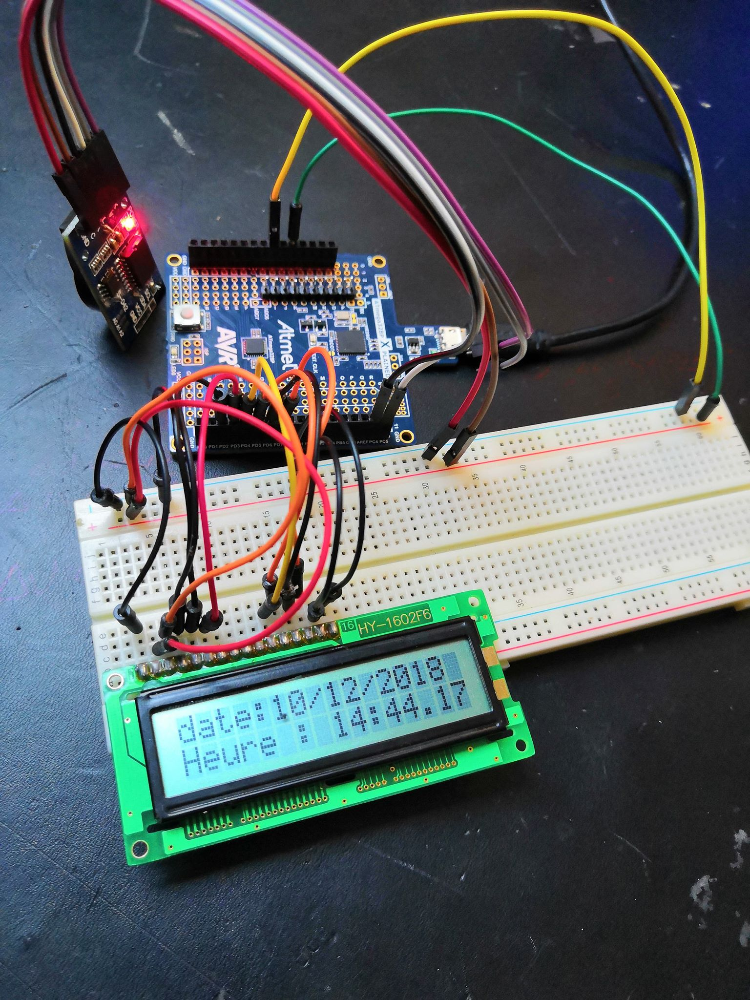

 <h1>Rapport du  10/12/18 de Kilian COLLIE:</h1>
 

  

<h2>
 <em>Premiere séance</em>
</h2>

  
<h3>L'avancement du projet:</h3>  
Dans cette séance nous nous sommes interessé a l'avancement du projet c'est a dire:
<ul>
  <li>comment va t'on se repartir le travail,
  <li>en combien de séances faire chaque parties, 
  <li>et surtout par quoi commencer...
</ul>
<h3>La plannification du projet:</h3>  
Tout d'abord j'ai construis le "planning" pendant que mon binome s'occupait de la description du projet (Voir Cahier des charges).
Evidemment c'est un projet en binome donc meme si chacun peut avancer de son coté il a fallu que chacun verifie et aide l'autre.
Apres avoir pris du temps sur cette etape importante, nous avons donc  commencé la premiere etape: Le fonctionnement du réveil.
<h3>Le premier pas dans le RTC:</h3>  
Nous avons d'abord mené des recherches sur ce que le professeur nous avez donné la semaine d'avant: un RTC(Real Time Clock).
Apres avoir fouillé le web pour des informations, nous avons écris un programme qui permettait de afficher sur le moniteur la date.
Apres avoir reussi, nous avons essayé de l'afficher sur un ecran LCD. Meme si le crenaux de 3h du projet etait ecoulé j'ai finis les branchements à la maison et pour l'instant on a une date affichée sur un écran!

<h1>Rapport du  17/12/18 de Kilian COLLIE:</h1>
 

  

<h2>
 <em>Deuxième séance</em>
</h2>

  
<h3>Création d'une application:</h3>
Pour gérer notre réveil et pour pour le programmer on pourra utiliser notre téléphone. Le but etant de faire un réveil connecté qui sera donc plus pratique. Pour cela on utilise le site<a href="http://appinventor.mit.edu/explore/# "> App Inventor </a> développé par Google et le MIT. 

On  va donc sur le site d'APP inventor 2 et après s'etre inscrit on crée l'apparence de notre l'application <em>(Voir capture d'écran suivante)</em>

Ensuite on va faire la partie programmation avec du code. Sur le site la partie est facilement accessible à tout niveaux puisque c'est de la programmtion par blocs.  

<em>J'ai donc programmé mon application</em>

Finalement on génère un QRCODE depuis le web et enfin on scanne le QRCODE sur application compagnon de notre téléphone qu'on vient de téléchargé. Cette application installe directement l'application sur notre téléphone et donc exécute notre code.

<em>Depuis l'ordinateur...</em>

<em>Depuis le téléphone...</em>

 J'ai programmé cette application pendant la séance en regardant quelques tutoriels sur youtube parce que 
Pour le moment l'application est une application"test": elle se connecte a notre module Bluetooth et affiche si le téléphone est bien connecté au Bluetooth . 
Ensuite sur le téléphone on peut choisir l'heure(heure et la minute) du réveil et le transmet via le Bluetooth a l’Arduino. Pour l'instant elle le transmet sous forme 1334 pour 13h34.

On ne peut donc pas encore récupérer l'heure et les minutes, c'est une chose sur laquelle on n'a pas encore de réponse. 
On a donc maintenant une  application quasi complète: il manque encore une peu de graphisme et de résoudre le problème de récupération de l'heure programmée.
<h3>La suite:</h3>
Il va donc falloir travailler pendant les vacances pour continuer et finir cette application.
On aura donc à la rentrée un réveil totalement programmable qui sonne puisque mon binôme doit gérer le buzzer pendant les vacances.
De plus pendant la séance on a essayé de changer l'écran qu'on a déjà vers 2 écrans OLED pour une meilleure résolution pour que notre réveil affiche l'heure mais affiche aussi des yeux lorsque qu'il va s'enfuir. Le robot aura donc un aspect plus sympathique...

<em>La photo était trop grosse mais c'est comme cela qu'on va programmer notre réveil depuis notre téléphone...</em>
 

<em>Grâce au code suivant:</em>

 <em>La suite va être de faire un réveil programmable depuis un ordinateur...</em> 

 <h1>Rapport du  06/01/19 de Kilian COLLIE:</h1>
   

<h2>
 <em>Travail de vacances</em>
</h2>

  
<h3>L'avancement du projet pendant les vacances:</h3> 

Alors tout d'abord il a fallu finir ce qui était commencé c'est-à-dire la npartie réveil, le code informatique de celle-ci et l'application sur le telephone. Ensuite une fois que tout marchait(voir vidéos et photos) j'ai tout re-modifié le code pour l'adapter et l'optimiser.Maintenant il est lisible facilement et donc facielement comprehensible, puisque j'ai tout découpé en fonctions: par exemple les fonctions :
<ul>
  <li> -qui va faire sonner le réveil
    <li> -la fonction qui récupère l'heure 
      <li> -la fonction qui récupère l'heure de l'alarme.
        </ul>
        
   
J'ai aussi continué mon application sur téléphone avec le site App inventor et l'application dédié (voir precedent rapport de seances). C'est-à-dire qu'on peut maintenant se connecter au Bluetooth et ensuite choisir l'heure à laquelle on va programmer l'alarme
. La suite de ce projet sera de pouvoir cocher une case (on/off) qui va nous dire si on veut activer l'alarme ou pas.On pourra  éventuellement rajouter d'autres alarmes et dautre bouton (comme sur un reveil de smartphone actuel).

Pendant ce temps-là mon binôme s'est chargé de faire marcher le BUZZER. Il ne suffira donc qu'à intégrer cette partie du code dans la fonction que j'ai crée. On va devoir après faire toute la partie robotique: c'est-à-dire le robot et le code qui permet de se déplacer intelligemment. Cela va être le point central de ce qui va se passer dans les prochaines séances de TD.

Il faut aussi qu'on change une autre écran LCD de base avec les deux écran OLED qui vont nous permettre d'afficher leur mais aussi 
des yeux virtuel pour rendre notre robot plus sympathique et plus convivial mon binôme était chargé d'étudier le fonctionnement de 
ces deux écrans pour qu'on puisse le modifier ensuite ensemble en TD . Si l'on devait faire un point sur l'avancée de notre projet 
je dirais qu'on a quasiment fini le réveil connecté (à quelques points près point évidemment :il faudra à modifier ajuster et 
même améliorer quelques chose comme au niveau de l'application). J'ai dû aussi faire des recherches sur comment écrire des fonctions 
en Arduino puisque nous n'avons pas vu ce point en cours.
En effet je ne savais pas quoi mettre comme type puisque nous travaillons dans notre projet avec des types "structures temps"(struct ts) importés d'une bibliothèque, c'est donc un type assez complexe! De plus il fallait savoir quoi renvoyer de la fonction et il fallait 
aussi faire attention a que les variables présent dans les fonctions marchent dans le main... Ce travail qui était en apparence assez simple puisqu'il s'agit il s'agissait juste de formalités a été finalement un peu plus dur que prévu.
J'ai rencontré quelques problèmes puisque ayant voyagé j'ai dû transporter mon Arduino et que comme nous l'avons vu en cours il y a beaucoup de branchement à faire sur: l'écran LCD + le Bluetooth + le capteur de distance + le module RTC ; ainsi les branchements ont été dérangé par le voyage donc quand je relancais le code plus rien ne marchait.Il a fallu donc à plusieurs reprises débrancher puis rebrancher le tout et ce fut assez long (Cela m'a fait perdre un certain temps).
Evidemment pendant les vacances j'ai aussi réfléchi aux problèmes qu'on allait avoir en faisant notre robot et celui des branchements: en effet il faut que ses branchement soit assez résistant aux chocs puisque notre robot va être assez "casse-cou" donc il va falloir bien souder puis bien isolé avec un materiau absorbant comme de la mousse par exemple...
L'objectif de la prochaine séance de TD va être d'assembler nos travaux des vacances puis de faire le montage électronique des écrans, du buzzer et du réveil qu'on a déjà. Puis viendra la partie robot...

 <h1>Rapport du  07/01/19 de Kilian COLLIE:</h1>
   

<h2>
 <em>Troisième Séance:</em>
</h2>

  
<h3>L'assemblement final:</h3> 

On a donc commencé par voir ce que chacun avait fait puis on a modifié le code du buzzer puisque celui ne fonctionnait pas très bien. Par manque de port sur note Arduino on a voulu debrancher notre ecran LCD pour mettre lecran oled . Cela nous donnera acces a plus de port pour brancher par exemple le buzzer. Nous nous somme donc attaqué a lecran OLED: nous avons commencé par comprendre comment cela marchait, puis nous avon essayer d'afficher "12h" . Il a fallu changer la taille de police puisque l'ecriture de "12h" etait trop petit et ne prenait pas le la place de tout l'écran. 
Ensuite j'ai decouvert la fonction .............. qui permet de dessiner un pixel particulier. Notre but etant d'afficher des yeux, on a d'abord pensé a dessiner des yeux de nous meme.. Connaissant notre talent artistique plutot médiocre, j'ai decidé d'utiliser http://javl.github.io/image2cpp/ qui est un site qui convertit une image en liste de pixel. Ensuite on a importé cette liste dans un programme pour tester. Voir capture d'écran. 
