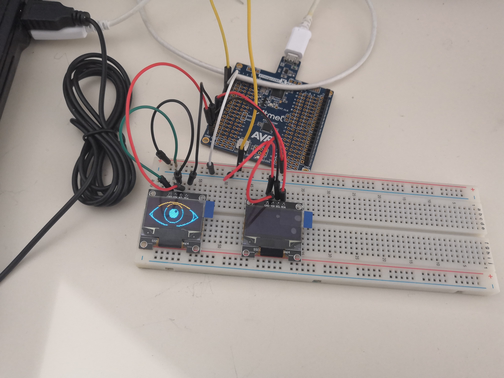
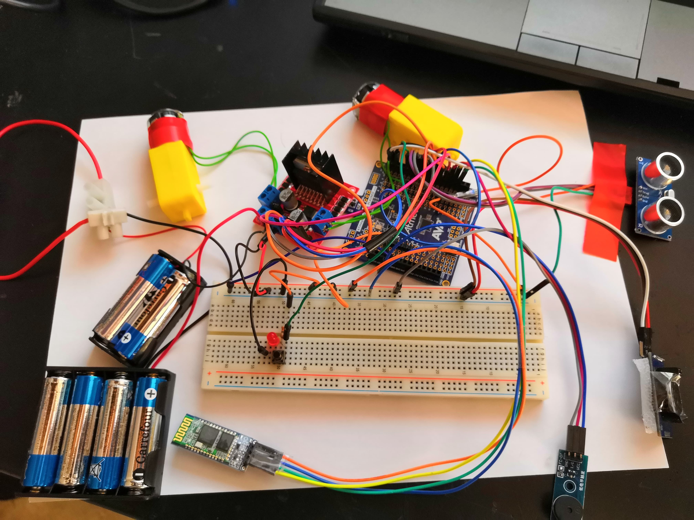
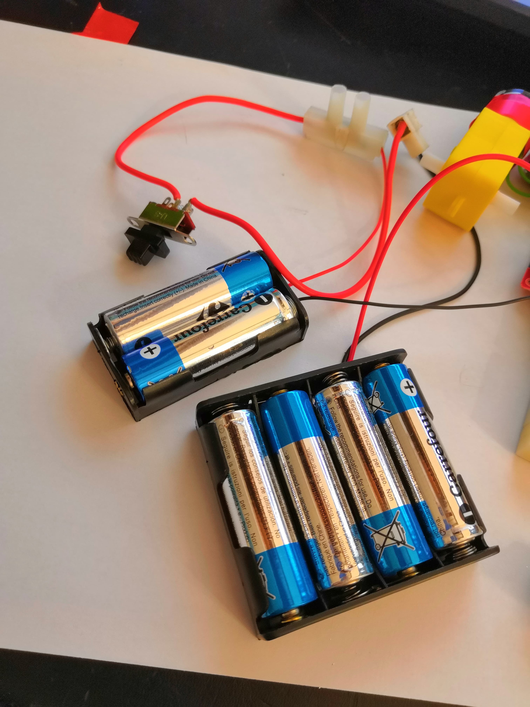
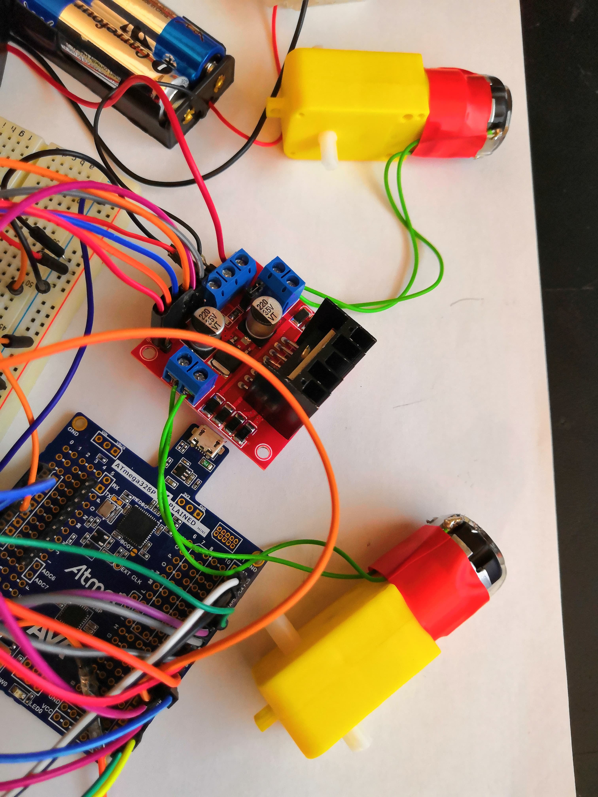
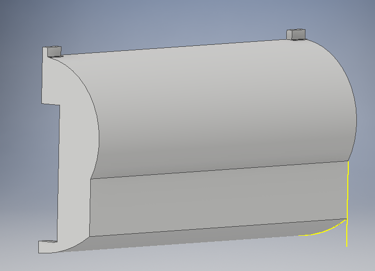
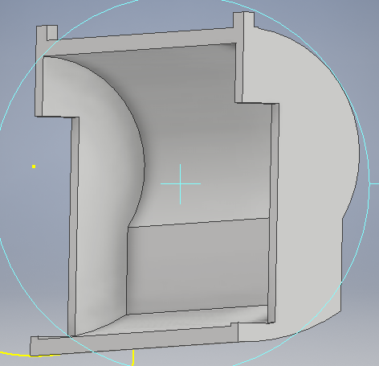
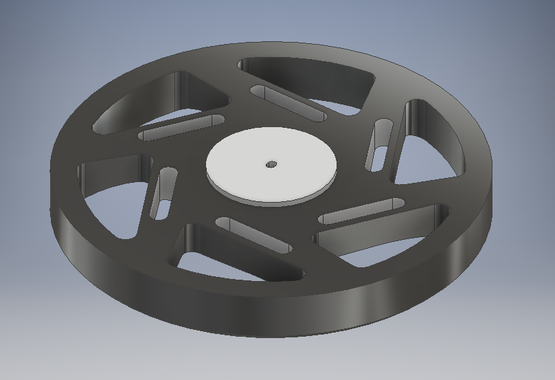
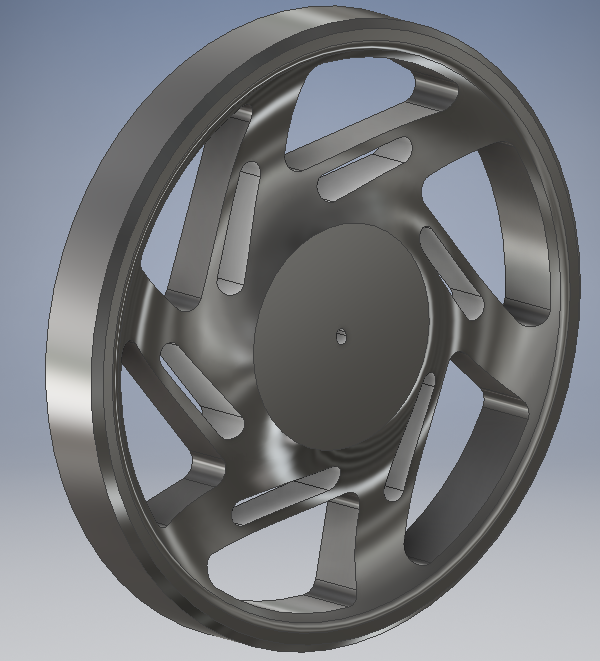
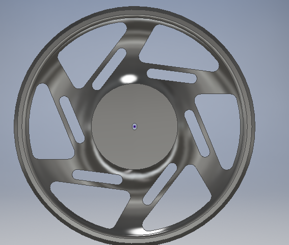

 <h1>Rapport du  10/12/18 de Kilian COLLIE:</h1>
 

  

<h2>
 <em>Premiere séance</em>
</h2>

  
<h3>L'avancement du projet:</h3>  
Dans cette séance nous nous sommes interessé a l'avancement du projet c'est a dire:
<ul>
  <li>comment va t'on se repartir le travail,
  <li>en combien de séances faire chaque parties, 
  <li>et surtout par quoi commencer...
</ul>
<h3>La plannification du projet:</h3>  
Tout d'abord j'ai construis le "planning" pendant que mon binome s'occupait de la description du projet (Voir Cahier des charges).
Evidemment c'est un projet en binome donc meme si chacun peut avancer de son coté il a fallu que chacun verifie et aide l'autre.
Apres avoir pris du temps sur cette etape importante, nous avons donc  commencé la premiere etape: Le fonctionnement du réveil.
<h3>Le premier pas dans le RTC:</h3>  
Nous avons d'abord mené des recherches sur ce que le professeur nous avez donné la semaine d'avant: un RTC(Real Time Clock).
Apres avoir fouillé le web pour des informations, nous avons écris un programme qui permettait de afficher sur le moniteur la date.
Apres avoir reussi, nous avons essayé de l'afficher sur un ecran LCD. Meme si le crenaux de 3h du projet etait ecoulé j'ai finis les branchements à la maison et pour l'instant on a une date affichée sur un écran!

<h1>Rapport du  17/12/18 de Kilian COLLIE:</h1>
 

  

<h2>
 <em>Deuxième séance</em>
</h2>

  
<h3>Création d'une application:</h3>
Pour gérer notre réveil et pour pour le programmer on pourra utiliser notre téléphone. Le but etant de faire un réveil connecté qui sera donc plus pratique. Pour cela on utilise le site<a href="http://appinventor.mit.edu/explore/# "> App Inventor </a> développé par Google et le MIT. 

On  va donc sur le site d'APP inventor 2 et après s'etre inscrit on crée l'apparence de notre l'application <em>(Voir capture d'écran suivante)</em>

Ensuite on va faire la partie programmation avec du code. Sur le site la partie est facilement accessible à tout niveaux puisque c'est de la programmtion par blocs.  

<em>J'ai donc programmé mon application</em>

Finalement on génère un QRCODE depuis le web et enfin on scanne le QRCODE sur application compagnon de notre téléphone qu'on vient de téléchargé. Cette application installe directement l'application sur notre téléphone et donc exécute notre code.

<em>Depuis l'ordinateur...</em>

<em>Depuis le téléphone...</em>

 J'ai programmé cette application pendant la séance en regardant quelques tutoriels sur youtube parce que 
Pour le moment l'application est une application"test": elle se connecte a notre module Bluetooth et affiche si le téléphone est bien connecté au Bluetooth . 
Ensuite sur le téléphone on peut choisir l'heure(heure et la minute) du réveil et le transmet via le Bluetooth a l’Arduino. Pour l'instant elle le transmet sous forme 1334 pour 13h34.

On ne peut donc pas encore récupérer l'heure et les minutes, c'est une chose sur laquelle on n'a pas encore de réponse. 
On a donc maintenant une  application quasi complète: il manque encore une peu de graphisme et de résoudre le problème de récupération de l'heure programmée.
<h3>La suite:</h3>
Il va donc falloir travailler pendant les vacances pour continuer et finir cette application.
On aura donc à la rentrée un réveil totalement programmable qui sonne puisque mon binôme doit gérer le buzzer pendant les vacances.
De plus pendant la séance on a essayé de changer l'écran qu'on a déjà vers 2 écrans OLED pour une meilleure résolution pour que notre réveil affiche l'heure mais affiche aussi des yeux lorsque qu'il va s'enfuir. Le robot aura donc un aspect plus sympathique...

<em>La photo était trop grosse mais c'est comme cela qu'on va programmer notre réveil depuis notre téléphone...</em>
 

<em>Grâce au code suivant:</em>

 <em>La suite va être de faire un réveil programmable depuis un ordinateur...</em> 

 <h1>Rapport du  06/01/19 de Kilian COLLIE:</h1>
   

<h2>
 <em>Travail de vacances</em>
</h2>

  
<h3>L'avancement du projet pendant les vacances:</h3> 

Alors tout d'abord il a fallu finir ce qui était commencé c'est-à-dire la npartie réveil, le code informatique de celle-ci et l'application sur le telephone. Ensuite une fois que tout marchait(voir vidéos et photos) j'ai tout re-modifié le code pour l'adapter et l'optimiser.Maintenant il est lisible facilement et donc facielement comprehensible, puisque j'ai tout découpé en fonctions: par exemple les fonctions :
<ul>
  <li> -qui va faire sonner le réveil
    <li> -la fonction qui récupère l'heure 
      <li> -la fonction qui récupère l'heure de l'alarme.
        </ul>
        
   
J'ai aussi continué mon application sur téléphone avec le site App inventor et l'application dédié (voir precedent rapport de seances). C'est-à-dire qu'on peut maintenant se connecter au Bluetooth et ensuite choisir l'heure à laquelle on va programmer l'alarme
. La suite de ce projet sera de pouvoir cocher une case (on/off) qui va nous dire si on veut activer l'alarme ou pas.On pourra  éventuellement rajouter d'autres alarmes et dautre bouton (comme sur un reveil de smartphone actuel). Vous pouvez le voir sur cette video:
https://www.youtube.com/watch?v=tpIhW9Wz9oE

Pendant ce temps-là mon binôme s'est chargé de faire marcher le BUZZER. Il ne suffira donc qu'à intégrer cette partie du code dans la fonction que j'ai crée. On va devoir après faire toute la partie robotique: c'est-à-dire le robot et le code qui permet de se déplacer intelligemment. Cela va être le point central de ce qui va se passer dans les prochaines séances de TD.

Il faut aussi qu'on change une autre écran LCD de base avec les deux écran OLED qui vont nous permettre d'afficher leur mais aussi 
des yeux virtuel pour rendre notre robot plus sympathique et plus convivial mon binôme était chargé d'étudier le fonctionnement de 
ces deux écrans pour qu'on puisse le modifier ensuite ensemble en TD . Si l'on devait faire un point sur l'avancée de notre projet 
je dirais qu'on a quasiment fini le réveil connecté (à quelques points près point évidemment :il faudra à modifier ajuster et 
même améliorer quelques chose comme au niveau de l'application). J'ai dû aussi faire des recherches sur comment écrire des fonctions 
en Arduino puisque nous n'avons pas vu ce point en cours.
En effet je ne savais pas quoi mettre comme type puisque nous travaillons dans notre projet avec des types "structures temps"(struct ts) importés d'une bibliothèque, c'est donc un type assez complexe! De plus il fallait savoir quoi renvoyer de la fonction et il fallait 
aussi faire attention a que les variables présent dans les fonctions marchent dans le main... Ce travail qui était en apparence assez simple puisqu'il s'agit il s'agissait juste de formalités a été finalement un peu plus dur que prévu.
Je vous joins ici le code du reveil tel avec les fonctions:
https://github.com/kilian-salome/Robot-reveil/blob/master/Rapports%20seances/Images-import/projet_2.ino
En outre j'ai aussi rajouté une "option" qui consiste a mettre en veille le reveil l'affichage du reveil sauf lorsque on passe la main au dessus du capteur de distance. Cela a un effet assez sympathique visuellement! J'ai crée une chaine YouTube pour mettre mes videos... voyez donc par vous-meme: https://www.youtube.com/watch?v=c7SeHy4BcdA

J'ai rencontré quelques problèmes puisque ayant voyagé j'ai dû transporter mon Arduino et que comme nous l'avons vu en cours il y a beaucoup de branchement à faire sur: l'écran LCD + le Bluetooth + le capteur de distance + le module RTC ; ainsi les branchements ont été dérangé par le voyage donc quand je relancais le code plus rien ne marchait.Il a fallu donc à plusieurs reprises débrancher puis rebrancher le tout et ce fut assez long (Cela m'a fait perdre un certain temps).
Evidemment pendant les vacances j'ai aussi réfléchi aux problèmes qu'on allait avoir en faisant notre robot et celui des branchements: en effet il faut que ses branchement soit assez résistant aux chocs puisque notre robot va être assez "casse-cou" donc il va falloir bien souder puis bien isolé avec un materiau absorbant comme de la mousse par exemple...
L'objectif de la prochaine séance de TD va être d'assembler nos travaux des vacances puis de faire le montage électronique des écrans, du buzzer et du réveil qu'on a déjà. Puis viendra la partie robot...
Video bonus:Test pour savoir si le reveil se declenche bien... https://www.youtube.com/watch?v=xC-7eWVmUok

 <h1>Rapport du  07/01/19 de Kilian COLLIE:</h1>
   

<h2>
 <em>Troisième Séance:</em>
</h2>

  
<h3>L'assemblement final:</h3> 

On a donc commencé par voir ce que chacun avait fait puis on a modifié le code du buzzer puisque celui ne fonctionnait pas très bien. Finalement nous sommes arrivés à ce code qui pemet de faire fonctionner le buzzer.

<em> Voir le code complet du buzzer: https://github.com/kilian-salome/Robot-reveil/blob/master/Rapports%20seances/Images-import/buzzer.ino </em>

Par manque de ports sur notre carte Arduino on a voulu débrancher notre écran LCD pour mettre l'écran OLED. Cela nous donnera accès à plus de ports pour brancher par exemple le buzzer. Nous nous sommes donc attaqué a l'écran OLED: nous avons commencé par comprendre comment cela marchait, puis nous avon essayer d'afficher "12h" . Il a fallu changer la taille de police puisque l'ecriture de "12h" etait trop petit et ne prenait pas toute la place de tout l'écran. 
Ensuite j'ai decouvert la fonction "display.drawBitmap" qui permet de dessiner un pixel particulier. Notre but étant d'afficher des yeux, on a d'abord pensé a dessiner des yeux de nous meme.. Connaissant notre talent artistique plutot médiocre, j'ai utilisé http://javl.github.io/image2cpp/ qui est un site qui convertit une image en liste de pixel. En effet nous voulions le dessiner avec des rectangles arrondis ce qui fut quasi impossible. Ensuite on a importé cette liste de pixels dans un programme pour tester.<em> Voir capture d'écran</em>

On a obtenu un résultat qu'on va devoir améliorer:

 <em> Voir le code complet du dessin: https://github.com/kilian-salome/Robot-reveil/blob/master/Rapports%20seances/Images-import/dessin.ino </em>
 
 
 
  <h1>Rapport du  14/01/19 de Kilian COLLIE:</h1>
 

  

<h2>
 <em>Présentation des projets</em>
</h2>

Pour présenter le projet j'ai essayé de tout scotcher comme me l'avais conseillé Mr Masson. Je ne sais pas si c'est a ca qu'il pensait mais jai tout scotché... ca  a tenu le voyage! 

ensuite jai rajouter le buzzer dans notre code en ajoutant des boucles(voir code). Lors se la compiation plusieurs erreur se sont declarées, en effet comme on la vu en cours le buzzer utilise le  Timer n°2 et il y a donc des conflits de libraries... ,
Solution simple j'ai trouvé une nouvelle librarie NewTone qui est la meme que la librairie Tone mais sans les conflits. (On l'a juste telechargé sur internet)  . Ensuite il a fallu eteindre le reveil, mainantenant que le buzzer sonne il ne sarretait plus. On a decidé que celui qui utiliserait le revil devra appuyer suer un bouon pour l'eteindre. On a donc rajouter un bouton poussoir comme celui vu en classe. De plus on a integrer dans notre code une variable "cond" (condition pour que le reveil sonne) qui renvoit une valeur (0 ou 1) qui va desactiver la sonnerie et qui va arreteer le reveil. Ensuite il suffira de renvoyere une autre alarme avec le telephone pour que le reveil se reprogramme. 

<h2>
 <em>Séance de TD</em>
</h2>
Durant le séance de Td on a modifié queques petites chose comme la sonnerie de notre reveil qui resemble maintenant a une alarme... ce qui a le don de reveiller facilement!  Ensuite on a continuer l'affichage des yeux sur nos ecran OLED, et la encore il se pose quelques problemes... comme les entrées pour les ecrans sont predefinis (PC5 et PC4) on a des problèmes pour connecter 2 écrans différents puisqu'il ont le meme "nom" (il existe surement un methode qui pemet de changer le nom d'un écran) . De plus notre écran n'affiche que soit:
<ul>
<li>du noir</li>
<li>du jaune en haut</li>
<li>du bleu en bas</li>
</ul>

et donc dessiner un oeil bleu et jaune et assez bizzare. 

On va chercher sur Ebay les memes ecrans mais en couleurs puisque ceux ci sont trers repandus et utilisent les meme libraries.

Au final on veut afficher lorsque le réveil est en veille(cest a dire que personne ne met sa mains devant pour demander l'heure) les 2 ecrans OLED afficheront des yeux qui rendront le reveil pluis vivant... et lorsque l'heure est demandé il affiche sur le premier l'heure et sur le deuxième les minutes. 

Pour le moment comme on n'arrive pas à connecter 2 écrans on a seulement l'heure.

Ensuite j'ai récuperer un ancien projet que je dois démonter pour avoir des moteurs.

<h1>Rapport du  04/02/19 de Kilian COLLIE:</h1>
   

<h2>
 <em>Le debut du Robot pendant les vacances</em>
</h2>

Pendant les vacances, le professeur m'a preté un mini robot pour tester un programme du robot Reveil. J'ai donc commencé a ecrire un programme qui fait avancer le petit robot, et qui si il y a un obstacxle proche, il recule puis il tourne. Pour cela j'avais  
utilisé un capteur de distance déja installé auparavant. tout cela était reié a mon arduino (puisque je n'avais pas le cable pour l'arduino preté sur le robot). Après plusieurs téléversement sur ma carte, j'ai du commetre une erreur puisque celle la ne fonctionnait plus. Comme j'éatis en vacances j'ai du attendre la rentrée pour faire "réparer" ma carte par le professeur. Je pense que la séquence d'initialisation était effacée. 

<h2>
 <em>La construction du Robot en TD</em>
</h2>
 Une fois l'arduino reparée, j'ai refait mon code pour le robot. Ensuite j'ai demandé au prof 2 moteurs et la carte rouge pour le controler. Ensuite j'ai soudés les 2 robots aux fils puis je les ai reliés au dominos de la petitre carte rouge. J'ai aussi connecté ENA, ENB, IN1, IN2, IN3,et IN4 à l'arduino puis la masse et le 5 volts. <em>Voir Images</em>
 
 
 
 
 On a commencé par me donner une alimentation qui fournit du 5Volts depuis la prise. Apres avoir tout branché et connecté l'alimentation à l'arduino et au moteur sur le port 5 Volts de la carte rouge. Après l'avoir allumé et meme en connectant l'arduino à l'ordi les volts n'était suffisant pour faire demarrer les moteurs (il fallait tourner les engrenages soi-meme pour faire démarrer les moteurs!). 
 
 
 
 Finalement je suis passé à une batterie de 4 piles de 1.5 volt(AA) donc du 6 volts. Cela fait tourner les moteurs correctement .
 
 
 
 Comme ce n'est pas facile de voir le sens des engrenages qui tournent j'ai emprunté des roues dans "l'armoire". Apres avoir téléversé mon programme et avoir connecté le capteur de distance à l'arduino notre robot avance jusqu'a rencontré un obstacle il recule pendant 1secondes puis tournent legerement(pendant 300 millis). 
 
 

<em>Video bonus:Test du programme du robot avec les moteurs...

https://www.youtube.com/watch?v=ScZquNIHZiI

et aussi le code pour les moteurs: https://github.com/kilian-salome/Robot-reveil/blob/master/Rapports%20seances/Images-import/moteurs_ex.ino"
</em>

<h1>Rapport du  11/02/19 de Kilian COLLIE:</h1>
   

<h2><em>L'assemblement "presque final"</em></h2>
La semaine dernière après le problème que j'ai rencontré avec ma carte Arduino, il a fallu tout débrancher pour la donner au professeur. Ensuite il a donc fallu tout rebrancher mais entre-temps j'ai essayé les moteurs et le programme pour les moteurs donc ce n'est que aujourd'hui que j'ai rassemblé tous les éléments qu'on avait précédemment. C'est-à-dire:
<ul>
<li>le capteur de distance 
<li>le bluetooth 
<li>le module RTC
<li>le buzzer
<li>le bouton poussoir
<li>et tous les moteurs et la petite carte rouge pour les controler
 </ul>

Au début j'ai commencé par remettre le module RTC puisque c'est la base d'une autre projet , après avoir vérifié que tout marche et bien j'ai rajouté le bluetooth puis je l'ai testé sur mon téléphone:celui-ci marchait très bien. Donc j'ai rajouté le buzzer pour activer la sonnerie, à chaque fois que j'ajoute est un élément à mon arduino je le testais et je m'assurerais de faire des branchements propres avec le minimum de fils nécessaire. Finalement j'ai rajouté le bouton poussoir pour pouvoir éteindre le réveil. Lorsque je l'ai mis en place, j'ai eu du mal à le faire fonctionner donc j'ai rajouté une petite LED pour vérifier que le bouton poussoir fonctionne bien (peut-être va-t-on la laisser dans le circuit puisque celle-ci et assez discrète et en même temps fait assez propre et professionnel).

Ensuite on a eu un petit problème au niveau du programme puisque j'avais fait une boucle avec une condition pour activer la sonnerie du réveil mais le problème c'est que cette boucle été vérifié seulement si on était à la même minute à la même heure que l'heure programmée sur le téléphone. C'est-à-dire que si on n'éteignez pas le réveil au bout de 1 minute, le réveil s'éteignait tout seul ce qui est fort embêtant Finalement j'ai modifié le code pour rajouter une autre condition qui est une condition "déclencheuse" c'est-à-dire qu'elle va déclencher la boucle mais elle ne va pas l'arrêter au bout d'une minute.
Maintenant que tout le code est "quasi parfait" <em> (voir code ci- dessous)</em>     j'ai donc tout testé et là je me suis rendu compte qu'il y avait un problème au niveau d'un moteur. J'ai donc essayé de le dépanner du mieux que j'ai pu en essayant d'afficher les boucles sur le moniteur de mon ordinateur mais rien à faire ... cela ne fonctionnait pas je me suis dit que c'était un problème d'alimentation et que 6 volts n'était peut-être pas suffisant pour le faire réagir suffisamment vite j'ai donc connecté une batterie en plus: 2 piles AA ce qui fait au total 6 piles (6 piles de 1,5 V fond donc 9 V ) .

Après avoir essayé cela ça ne marche toujours pas, certes les moteurs avait une puissance plus grande mais cela ne fonctionnait pas. C'est pour ça que on va sûrement garder le 9 volts qui me paraît être le voltage nécessaire ensuite j'ai rajouté un petit interrupteur pour pouvoir arrêter le réveil où le mettre en marche. Cet interrupteur n'était peut-être pas nécessaire mais il est bien pratique dans mon cas puisqu'il me permet de ne pas débrancher les piles à chaque fois que je veux l'éteindre! J'ai dû appeler le professeur pour qu'il m'aide avec le moteur et après avoir bidouillé et testé plein de pannes courantes et bien en fait il y avait deux fils qui était échangés! Une erreur assez bête et pourtant très coriace... 

Le code presque final: https://github.com/kilian-salome/Robot-reveil/blob/master/Rapports%20seances/Images-import/projet_3.ino"
 
 On a donc un réveil qui déclenche le moteur et une sonnerie et qui s'éteint avec un bouton.
 La dernière étape va être d'ajouter les écrans que mon binôme est en train de préparer et le projet pourra finalement être bientot terminé!
 

<h2><em>Le début de "l'encapsulage"</em></h2>
  Avant d'aller au FabLab il faut savoir quoi imprimer... Pour cela on m'a conseillé le logiciel OpenScad. Après l'avoir installé, j'ai regardé pas mal de tutos sur Internet pour comprendre un minimum.  

<h1>Rapport du  25/02/19 de Kilian COLLIE:</h1>
   

<h2><em>L'impression 3D </em></h2>

 Au début je voulais faire avec le logiciel Openscad que m'avait conseillé le professeur mais en regardant plusieurs tutoriel sur Internet et des explications j'ai compris que ça allait vite être très compliqué... De plus la forme que nous désirons et une forme assez complexe puisque elle doit accueillir les moteurs et tout le système et qu'elle  doit permettre de mettre un contrepoids. Tout ca  en étant pas trop grosse pour que les roues soit de taille raisonnable.

 J'ai donc utilisé un logiciel qu'on avait vu l'année dernière en cours de construction mécanique Inventor de Autodesk, c'est un logiciel très facile à utiliser d'autant plus qu'on en a appris l'utilisation et avec ça j'ai plus assez rapidement visualiser la base de notre robot.<em> voir capture d'écran </em>

 Ensuite comme il a fallu avoir des roues qui dépasse du robot j'ai  calculé qu'il nous fallait des roues d'un rayon de 7 cm (ce qui fait des roues assez grandes) , on a donc décidé de les imprimer avec une imprimante 3D aussi. Pour cela j'ai cherché sur internet à télécharger des roues qui était déjà créé et je les ai un peu modifié pour qu'elle sois parfaite avec notre moteur et avec ses engrenages.

 Dans la semaine nous allons aller au fablab pour imprimer les 4 objets: c'est-à-dire 2 roues et les 2 parties du robot puis la ensuite sera de fixer avec des vis.
Ensuite nous allons devoir mettre du caoutchouc autour des roues pour ne pas qu'elle glisse sur le sol ni qu'elle dérape et de la mousse dans le robot pour tous bien caser pour que n'y ait plus rien qui bouge.

 Aujourd'hui j'ai scotché tous les branchements avec du scotch spécial comme me l'a conseillé le professeur j'ai aussi changé la carte Arduino avec une nouvelle carte Arduino plus pratique et certainement moins cher.

 Pendant ce temps mon binôme et moi avons reçu les deux nouveaux écrans, ils ont l'air super et mon binôme se charge de les faire fonctionner pour pouvoir afficher l'heure et pour pouvoir afficher des yeux, le problème étant de séparer les deux écrans voir son rapport.

De plus cette semaine j'ai modifié l'application pour qu'elle soit plus présentable et plus "design". J'ai ajouté quelque options comme le faite que l'application indique l'heure a laquelle le reveil est programmé.
Voir la vidéo https://www.youtube.com/watch?v=RexiRixnaQ0 pour une bréve présentation de cette nouvelle application réveil!

